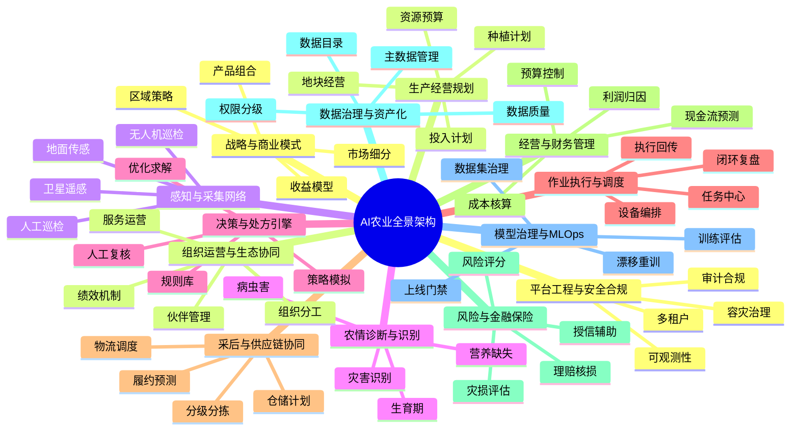
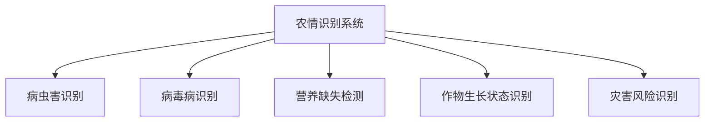
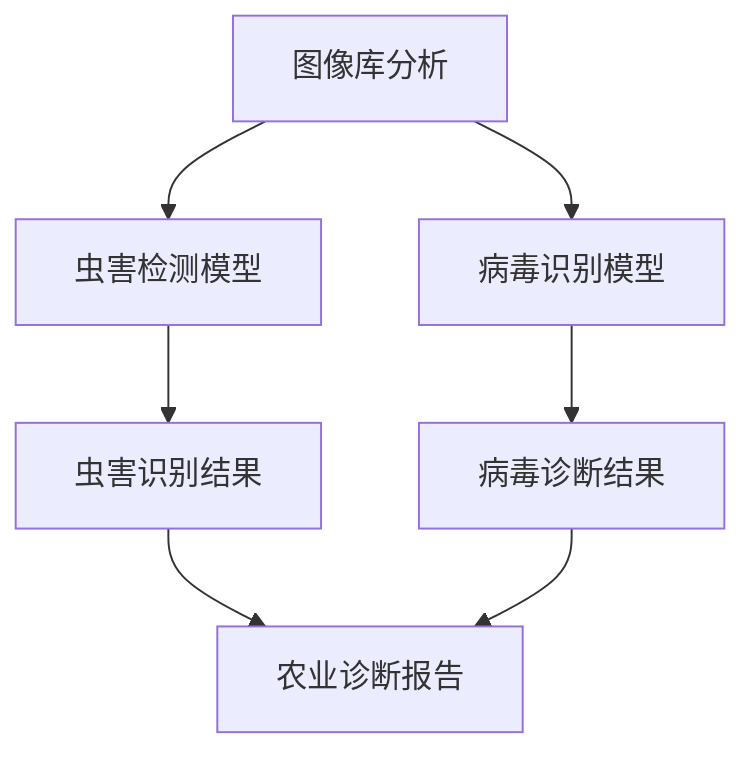

# AI农业智能诊断系统  演示稿

主题：AI农业体系中的虫害检测与病毒识别能力  
适用听众：农业经营主体、园区管理方、政府项目方、技术团队

## 1. 开场：先看AI农业全景，切入点
AI农业不是“单模型识别”，而是从经营目标出发，打通感知、诊断、决策、执行、复盘的系统工程。  
开始阶段建议先讲“大图景”：AI如何服务农业经营全链路，再落到今天的Demo重点能力。

这一全景可归纳为三层主线：

1. 感知层：采集真实、连续、可追溯的田间数据。  
2. 诊断层：把数据转成可解释的农情判断。  
3. 决策执行层：把判断转成可落地的作业动作与经营结果。  

## 2. AI农业相关支线
为了便于汇报和立项，建议将AI农业拆成五条业务支线来讲。

### 2.1 生产管理支线（高频、刚需）
目标：提升田间管理效率与准确性。  
关键能力：

1. 病虫害识别与分级（轻/中/重）。  
2. 杂草识别与精准喷洒区域规划。  
3. 营养缺失诊断（缺氮/缺磷/缺钾等）。  
4. 生长阶段识别（苗期、拔节、开花、灌浆等）。  

典型输出：风险地块清单、病虫热力图、施药建议、巡检报告。

### 2.2 资源与环境支线（降本重点）
目标：减少水肥药浪费，提高资源利用率。  
关键能力：

1. 土壤墒情监测与灌溉需求预测。  
2. 叶温/热成像识别水分胁迫。  
3. 气象与农情融合预警（高温、风灾、倒伏风险）。  

典型输出：水肥药变量处方、灌溉策略、预警消息。

### 2.3 产量与品质支线（增收重点）
目标：提前锁定产量与品质风险，优化采收窗口。  
关键能力：

1. 株高、叶面积指数、生物量估算。  
2. 产量预测与分区产量地图。  
3. 果实成熟度与品质分级。  

典型输出：产量预测区间、采收节奏建议、品质分级结果。

### 2.4 风险与金融支线（经营保障）
目标：提升抗风险能力，服务保险与信贷业务。  
关键能力：

1. 灾害识别与灾损评估。  
2. 风险评分与理赔核损辅助。  
3. 授信辅助与保费测算支持。  

典型输出：灾损报告、风险评分卡、理赔证据链。

### 2.5 经营与供应链支线（规模化关键）
目标：让“种得好”转化为“卖得好、管得好”。  
关键能力：

1. 投入品与作业成本核算。  
2. 仓储、物流、履约预测协同。  
3. 地块级利润归因与经营复盘。  

典型输出：成本利润分析、履约预测、经营驾驶舱。

## 3. AI农业核心闭环（从识别到经营结果）
AI农业的核心价值在于形成持续优化的闭环，而不是单次识别。

闭环运行逻辑：

1. 采集：无人机、摄像头、传感器、人工巡检共同输入。  
2. 识别：模型完成病虫害、病毒病、营养异常等诊断。  
3. 决策：结合农艺规则、历史数据、地块约束生成处方。  
4. 执行：无人机喷洒、智能农机、人工作业协同执行。  
5. 回传：记录作业与效果，反哺模型与规则更新。  

## 4. 本次聚焦能力：虫害检测 + 病毒病识别
在全景体系中，虫害与病毒病识别属于最常见、最易产生直接价值的入口场景。

本次展示重点：

1. 自动识别农作物虫害类型与风险程度。  
2. 自动识别病毒病表征并给出初步诊断结果。  
3. 输出可执行的处理建议与处置优先级。  

技术说明（审慎口径）：

1. 虫害检测通常可采用目标检测模型（如 YOLO、Faster R-CNN）。  
2. 病毒病识别通常可采用图像分类或多任务模型。  
3. 实际部署需结合当地作物品种、拍摄条件、农艺规则与人工复核。  

## 5. 系统结构与演示流程
本Demo采用“双模型并行识别 + 统一报告输出”的结构。

演示流程（建议口播顺序）：

1. 图像库分析：导入叶片图像或田间照片。  
2. 识别执行：系统并行完成虫害检测与病毒病识别。  
3. 结果展示：展示病害类型、置信度、风险等级。  
4. 农艺建议：给出防治建议、复检建议、作业优先级。  
5. 闭环留痕：将本次结果写入巡检记录，作为后续比较基线。  

## 6. 行业落地案例（可用于汇报佐证）
以下为公开资料中常见的农业AI落地方向，可作为项目汇报中的案例素材。

### 6.1 国外案例（平台化与数据驱动）
1. TerraClear（美国）：聚焦AI识别与田间自动化任务，强调作业效率提升。  
2. Taranis（以色列/全球）：以叶片级作物智能和AI农学服务为核心。  
3. Skysense（加拿大/全球）：卫星与无人机融合监测，强化区域尺度分析能力。  

### 6.2 中国案例（软硬一体与场景深耕）
1. XAG/极飞：无人机、农机自驾、智能灌溉和数智平台协同。  
2. 平谷西营未来智慧果园：天空地一体化监测与无人作业装备集群。  
3. 联通繁昌数字农田科技小院：5G + 物联网 + 大数据在农田管理中的协同应用。  
4. 神农AI农场（怀柔雁栖）：推动农业大模型能力与实体生产场景结合。  

说明：案例数据在不同来源中口径可能存在差异，建议在正式对外发布前按最新公开数据做一次核对。

## 7. 项目实施路径与优先级建议
建议按“高价值、低风险、可复用”的原则分阶段推进。

### 7.1 第一阶段
1. 病虫害识别。  
2. 病毒病识别。  
3. 巡检报表与基础看板。  

目标：先建立可演示、可试点、可复盘的最小闭环。

### 7.2 第二阶段
1. 杂草识别与变量喷洒联动。  
2. 生长监测与产量预测。  
3. 智能灌溉策略联动。  

目标：形成“诊断 + 处方 + 执行”的业务闭环。

### 7.3 第三阶段
1. 供应链与经营分析联动。  
2. 保险理赔与风险金融联动。  
3. 多区域复制与模型治理体系建设。  

目标：从单点能力升级为区域级数字农业运营系统。

## 8. 系统价值表达
本系统价值可从四个维度表达：

1. 效率：由高频人工巡检转为智能辅助巡检。  
2. 风险：由事后发现转为早期识别与前置干预。  
3. 成本：通过精细化管理降低单位地块的水肥药与人工成本。  
4. 规模：通过标准化流程支撑多地块、多作物复制。  

建议同步展示三类指标：

1. 识别指标：准确率、召回率、误报漏报率。  
2. 作业指标：处置时效、任务完成率、复检闭环率。  
3. 经营指标：单亩投入变化、产量变化、利润变化。  

## 9、政策支持与市场机会

### 9.1 中国政策支持
- 国家《"十四五"推进农业农村现代化规划》：建设数字田园
- 中央一号文件：支持发展智慧农业，拓展AI、数据、低空技术应用场景
- 目标：2030年农业生产信息化率达35%，2035年突破40%

### 9.2 市场机会
- 农业无人机市场：2024年29.4亿美元 → 2032年36.55亿美元
- 中国智慧农业监测系统：2025年突破120亿元
- 设施农业监测需求：年增速35%
- 农药市场：全球农药损失20-40%由病虫害造成，价值2200亿美元

### 9.3 技术趋势
- 低空经济上升为国家战略
- AI大模型在农业中应用（如Sinong农用大模型）
- 跨境农业技术服务需求增长
- 软硬一体化解决方案成为主流

## 10. 总结
AI农业的核心不是单个算法，而是围绕经营目标构建可持续优化的系统能力。  
今天的 Demo 以“虫害检测 + 病毒识别”为切入点，展示AI农业从识别到决策的关键第一步。

接下来进入 Demo 演示：AI农业智能诊断系统。